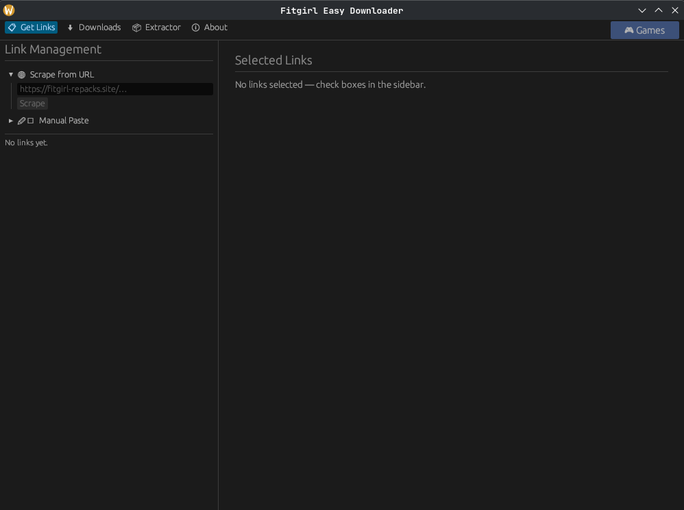
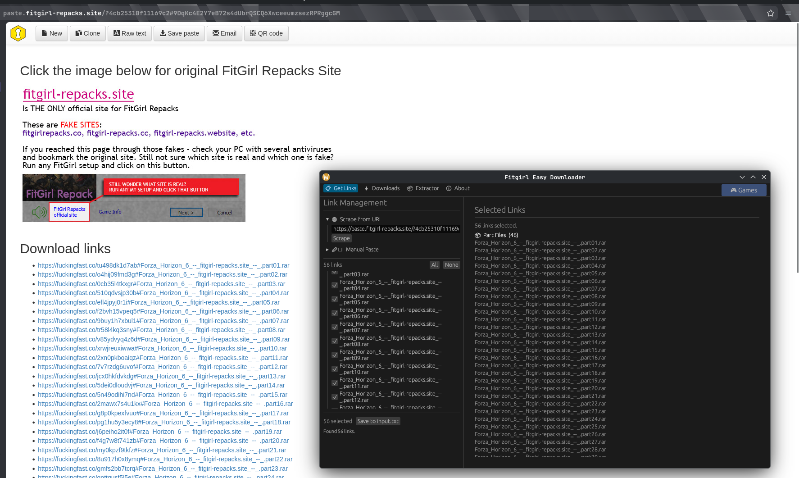
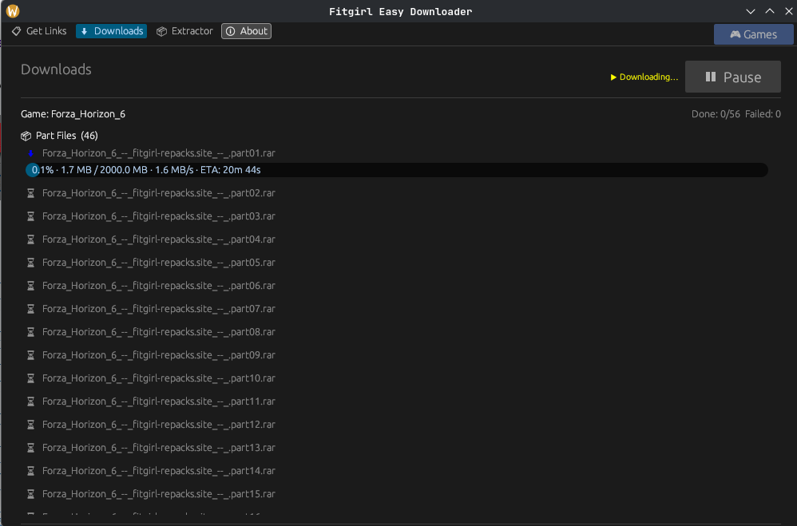
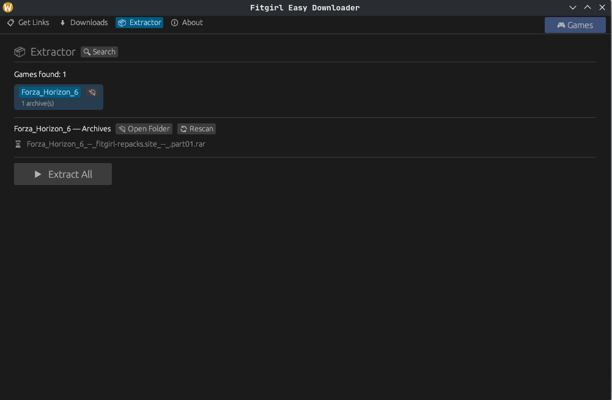
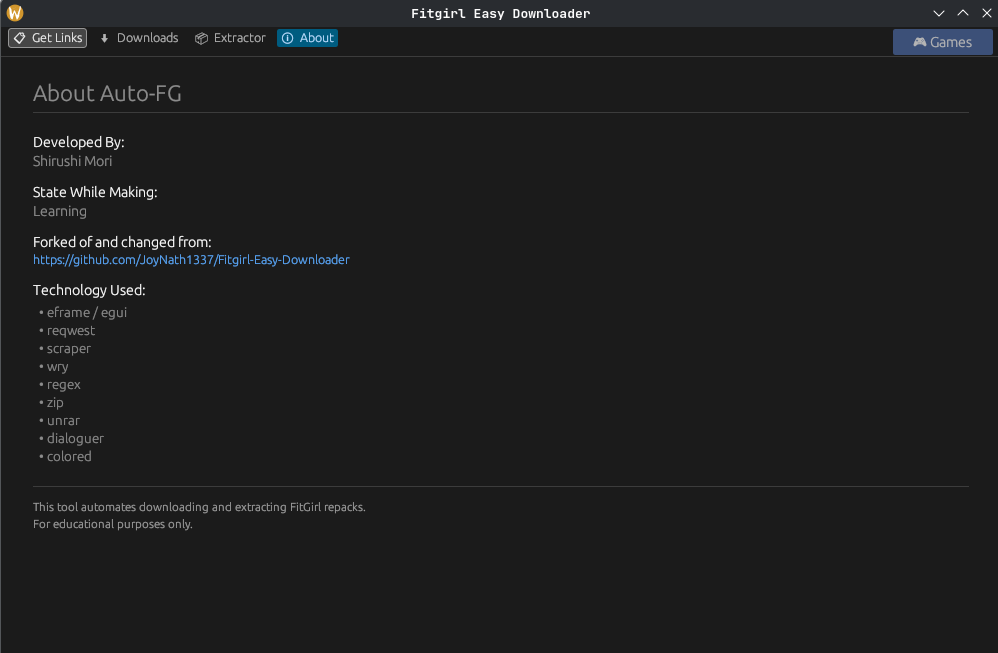

# FuckingFast FitGirl Download Automator

just a lil tool to grab fitgirl repacks from fuckingfast.co links without losing your mind. comes with a built-in browser so you can browse repacks, batch download stuff, and auto-extract zip/rar archives.

## what it does

- **scrapes links** — automatically grabs fuckingfast.co links from fitgirl pages and privatebin pastes
- **sorts stuff** — separates part files, optional files, and other stuff so you know wtf you're downloading
- **batch download** — downloads everything you selected one by one with progress, speed, eta
- **pause/resume** — pause whenever, resume whenever
- **smart resume** — finished files get removed from queue; close and reopen and it picks up where it left off
- **built-in browser** — browse fitgirl repacks inside the app (x11) or opens in your regular browser (wayland)
- **archive extraction** — extracts .rar and .zip files, each into its own folder
- **multi-part rar** — detects multi-part archives and only extracts the first part (the smart one)
- **cli tools** — `get-links` and `download` standalone binaries if you hate guis

## screenshots







## quick start

### linux

```bash
mkdir Applications
cd Applications
git clone https://github.com/shirushimori/Auto-FG
cd Auto-FG
chmod +x setup.sh && ./setup.sh
Auto-FG
```

script handles: rust install → dependencies → build → desktop shortcut. after that just run `Auto-FG` from terminal or click the desktop icon.

### arch linux (aur)

```bash
yay -S auto-fg
# or
paru -S auto-fg
```

### any linux (appimage)

download from the [releases page](https://github.com/shirushimori/Auto-FG/releases):

```bash
chmod +x Auto-FG-x86_64.AppImage
./Auto-FG-x86_64.AppImage
```

### windows

```cmd
git clone https://github.com/shirushimori/Auto-FG
cd Auto-FG
setup.bat
```

script handles: rust install → build → start menu + desktop shortcuts. launch from start menu or desktop.

### or do it manually

```bash
git clone https://github.com/shirushimori/Auto-FG
cd Auto-FG
cargo run --release
```

## how to use

### gui

1. run `cargo run --release`
2. go to **get links** tab — paste a fitgirl url or dump links manually
3. pick what you want to download
4. click "save to input.txt"
5. go to **downloads** tab and click "download it"
6. once done, go to **extractor** tab and click "extract all"

### cli 

```bash
# interactive link picking
cargo run --release --bin get-links

# download everything in input.txt
cargo run --release --bin download
```

## project structure

```
src/
├── bin/
│   ├── get_links.rs      # cli link scraper
│   └── download.rs        # cli downloader
├── lib.rs                 # core: scraping, decryption, downloading
├── main.rs                # gui (eframe/egui)
├── webview.rs             # embedded browser (wry/gtk or system browser)
└── extractor.rs           # zip/rar extraction
```

## tech stuff

| bit | what it uses |
|---|---|
| gui | [eframe](https://github.com/emilk/egui) / [egui](https://github.com/emilk/egui) |
| browser | [wry](https://github.com/tauri-apps/wry) |
| http | [reqwest](https://github.com/seanmonstar/reqwest) |
| html parsing | [scraper](https://github.com/causal-agent/scraper) |
| rar | [unrar](https://github.com/mozilla/unrar) |
| zip | [zip](https://github.com/zip-rs/zip2) |
| clipboard | [arboard](https://github.com/1Password/arboard) |

## license

mit. see [license](https://github.com/shirushimori/Auto-FG?tab=MIT-1-ov-file) if you care.

## disclaimer

this is for educational purposes. don't be a dick.
